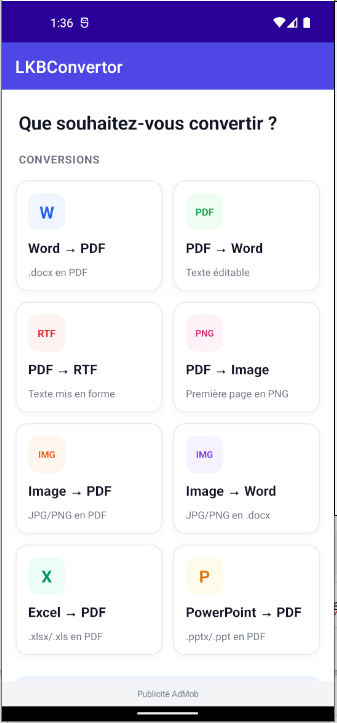
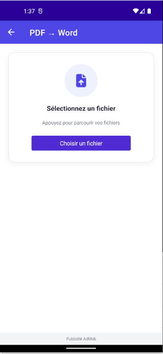
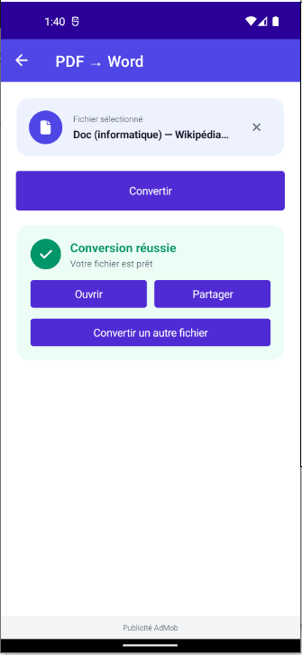
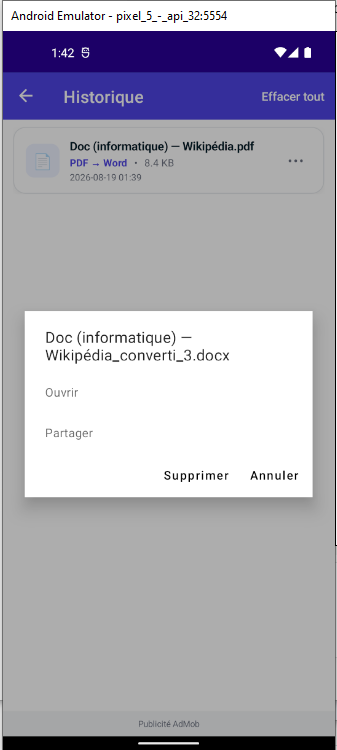

# LKBConvertor


Application Android de conversion de documents multi-format, développée en **.NET 9 MAUI**.

Publication Google Play prévue (compte en cours de validation).

---

## Fonctionnalités

Huit conversions bidirectionnelles disponibles, entièrement hors ligne :

| Depuis | Vers | Moteur |
|---|---|---|
| Word (`.docx`, `.doc`) | PDF | Syncfusion DocIORenderer |
| PDF | Word (`.docx`) | Syncfusion PdfLoadedDocument + DocIO |
| PDF | RTF | Syncfusion PdfLoadedDocument + DocIO |
| PDF | Image (`.png`) | Android `PdfRenderer` natif |
| Image (`.jpg`, `.png`) | PDF | Syncfusion Pdf.Graphics |
| Image | Word | Syncfusion DocIO |
| Excel (`.xlsx`, `.xls`) | PDF | Syncfusion XlsIORenderer |
| PowerPoint (`.pptx`, `.ppt`) | PDF | Syncfusion PresentationRenderer |

**Visionneuse universelle intégrée** : ouvre `.pdf`, `.doc(x)`, `.rtf`, `.odt`, `.txt`, `.xls(x)`, `.ppt(x)`, `.jpg`, `.png`, `.bmp` via conversion transparente en PDF temporaire pour l'affichage dans `SfPdfViewer`.

**Historique persistant** avec partage (Gmail, Drive, tout app supportant `ACTION_SEND`) et suppression individuelle ou totale.

---

## Stack technique

**Application**
- .NET 9 MAUI
- C#
- XAML + MVVM
- `Microsoft.Extensions.DependencyInjection` (DI complète, factories `Func<T, Page>`)
- SQLite via `sqlite-net-pcl` (connexion unique, purge auto)

**UI**
- UraniumUI Material 3
- Syncfusion Maui Toolkit (Cards)
- Syncfusion Maui PdfViewer
- FontAwesome (icônes vectorielles)

**Conversion documentaire**
- Syncfusion DocIO / DocIORenderer
- Syncfusion Pdf / PdfViewer
- Syncfusion XlsIO / XlsIORenderer
- Syncfusion Presentation / PresentationRenderer
- Android `PdfRenderer` natif (pour PDF → Image sans package payant)

**Android**
- `FileProvider` dédié (autorité `${applicationId}.share.fileprovider`)
- Partage inter-apps avec `ClipData` + `FLAG_GRANT_READ_URI_PERMISSION` (compat Gmail send-later)
- Permissions minimales — pas de `READ_MEDIA_*` superflue
- Scoped storage Android 10+
- Cible SDK Android 35, min SDK 21

---

## Architecture

```
Views/          # ContentPage XAML + code-behind minimal
ViewModels/     # INotifyPropertyChanged + Command MAUI
Services/       # ConversionService, NavigationService, ShareHelper
Models/         # DTOs + enum ConversionType
Data/           # LKBDatabase (SQLite)
Helpers/        # InverseBoolConverter (IValueConverter)
```

Navigation par DI :
```csharp
services.AddTransient<Func<ConversionType, ConversionPage>>(sp =>
    type => ActivatorUtilities.CreateInstance<ConversionPage>(sp, type));
```

---

## CI/CD

Pipeline Azure DevOps ([`azure-pipelines.yml`](azure-pipelines.yml)) :

1. **Build** — restore, MAUI Android workload, SonarCloud (scanner MSBuild), audit `dotnet list --vulnerable`, signature AAB via keystore stocké en Secure Files, publication d'artefact
2. **DeployInternal** — Google Play piste interne (auto sur `main`)
3. **PromoteBeta** — promotion internal → beta (approbation manuelle)
4. **PromoteProd** — promotion beta → production, rollout progressif 10 % (approbation manuelle)

---

## Aperçu

| Accueil | Sélection fichier | Conversion réussie | Historique |
|---|---|---|---|
|  |  |  |  |

## Démo

*Vidéo à venir — enregistrement émulateur Android en cours*

---

## Build local

```bash
dotnet workload install maui-android
dotnet restore LKBConvertor/LKBConvertor.csproj
dotnet build LKBConvertor/LKBConvertor.csproj -f net9.0-android
```

Pour un APK Release non signé :

```bash
dotnet publish LKBConvertor/LKBConvertor.csproj \
    -c Release -f net9.0-android \
    -p:AndroidPackageFormat=apk
```

Prérequis :
- .NET 9 SDK
- JDK 17
- Android SDK API 35 (installé auto via `dotnet build -t:InstallAndroidDependencies`)

---

## Auteur

**Arthure Lekoubou Djune** — [github.com/Arthure-code](https://github.com/Arthure-code)

Étudiant en Développement d'applications sécuritaires, Cégep Limoilou (Québec).
Certifications Microsoft AZ-900, DP-900, SC-900.
